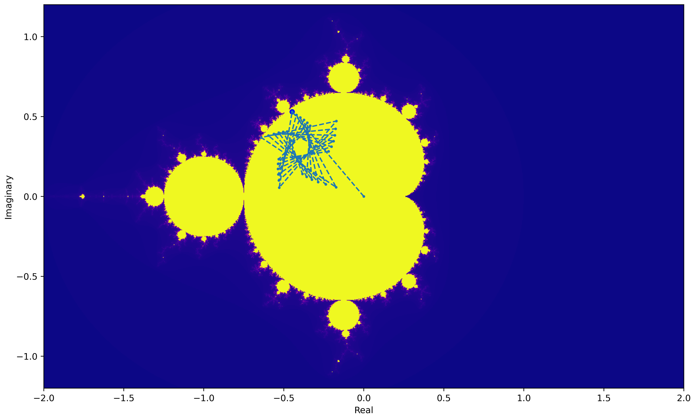
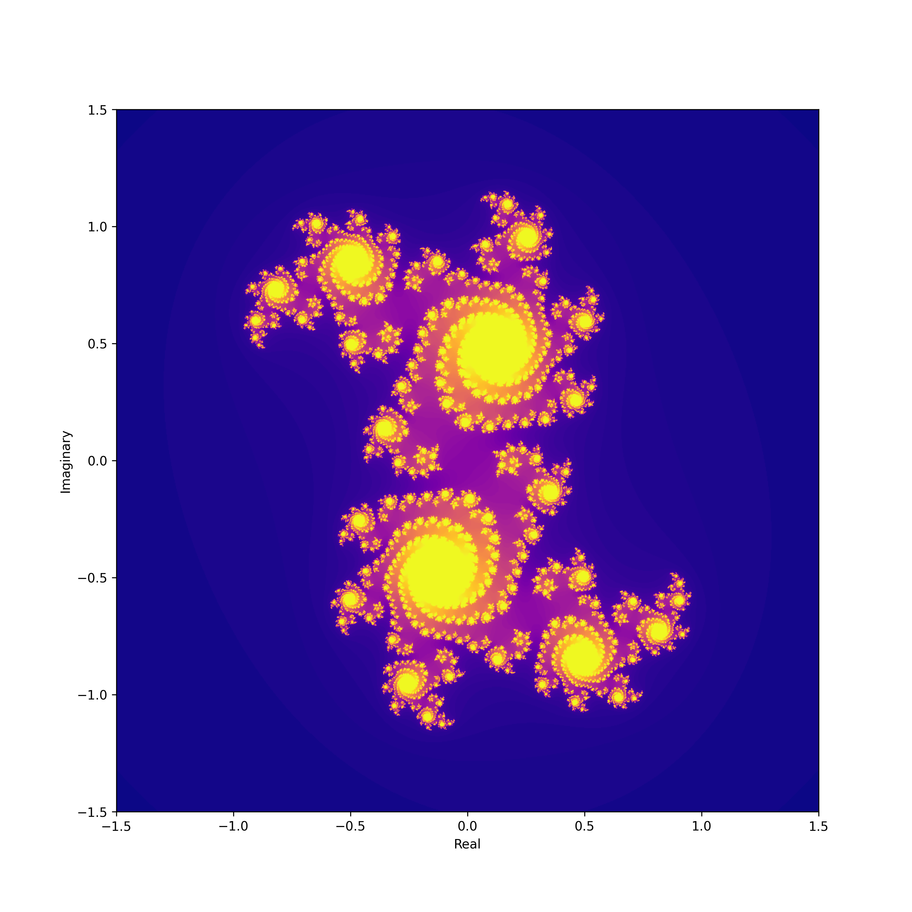
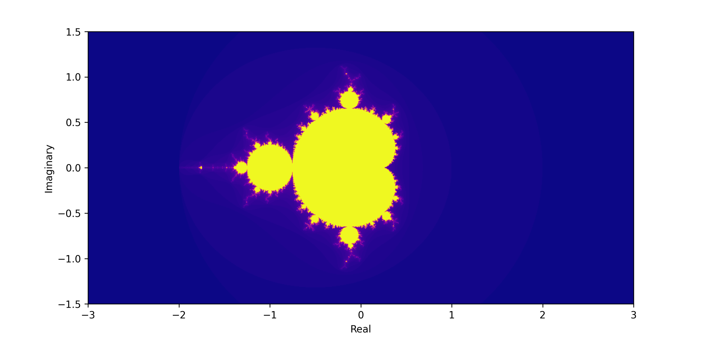

# Fractal Explorer

This project provides tools to visualize and analyze the Mandelbrot and Julia sets. It includes functionalities to interact with plots and observe the behavior of specific points.

## Features

- **Mandelbrot Set**: Generate and visualize the Mandelbrot set.
- **Julia Set**: Generate and visualize Julia sets for specified parameters.
- **Trajectory Tracking**: Observe the trajectory of points under iteration.



## Installation

### From Compiled Executable

1. Download the compiled executable file [from this link](dist/fractal_explorer.exe).
2. Place the executable file in a desired directory.
3. Run the executable from the command line with desired options.


### From Source Code

1. Clone the repository:
   ```bash
   git clone https://github.com/your-username/fractal-explorer.git
    ```

2. Navigate to the project directory:
   ```bash
   cd Fractal_Explorer
   ```

3. Install required dependencies:
   ```bash
   pip install numpy matplotlib
   ```

## Usage
Run the script with desired options from the command line:

### Julia Set

```bash
fractal_explorer.exe --julia --resolution=1000,100 --julia --julia_c=0.355+0.355j
```




### Mandelbrot Set

```bash
fractal_explorer.exe --plot_limit=3,1 --resolution=1000,500
```




## Parameters

- `--julia`: Flag to generate Julia set. Mandelbrot set is generated by default.
- `--show_trajectory`: Flag to display trajectory.
- `--trajectory_iterations`: Integer for trajectory iterations (default: 30).
- `--image_iterations`: Integer for function-iteration for each value. Higher number equals a more detailed fractal (default: 100).
- `--grid`: Flag to display grid on plot.
- `--julia_c`: Complex number for Julia set (default: 0+0j).
- `--plot_limit`: plot limits for x and y axis (default: 1.5, 1.5).
- `--resolution`: plot resolution for x and y axis (default: 600, 600).


